# <center> 流水线CPU的设计

<center>无83   &nbsp;  &nbsp;  周君宝   &nbsp;  &nbsp;     2018011106</center>

## 实验目的：
熟悉流水线CPU的原理和结构，学会设计基本的流水线处理器。
熟练使用Vivado和编写VerilogHDL，掌握一般的硬件设计方法。


## 设计方案：

### 硬件组成：

1. 流水线CPU
2. 主存
3. 定时器、LED、7段数码管等外设。

### 流水线CPU实现的功能：
  1.	5级流水线（IF、ID、EX、ME、WB）
  2.	支持异常（未定义指令）和中断（定时器）的处理。
  3.	对于Data Hazard，CPU采用完全的 forwarding 电路解决数据关联问题。对于Load-Use Hazard，采用stall加forwarding电路解决问题。
  4.	对于J型指令，采用取消IF阶段指令解决分支冒险
  5.	对于branch指令，当分支发生时采用取消IF、ID阶段的指令解决分支冒险。
  6.	支持 30 条 MIPS 指令

  - I型指令： lw, sw, , addi, addiu, lui, andi, ori, slti, sltiu

  - R型指令： add, addu, sub, subu, and, or, xor, nor, sll, srl, sra, slt

  - 分支和跳转指令: beq, bne, blez, bgtz, bltz 和 j, jal, jr, jalr

  7.	通过访问外设地址空间的方式实现访问和操纵外设，可操纵或访问的外设包括：7段数码管、8个LED灯、定时器、系统时钟计数器SysTick。

## 流水线CPU原理详述及关键代码：

流水线CPU的数据通路图如下：（原图文件：images/pipeline.jpg，设计图文件：pipeline.drawio，打开方式：www.draw.io）

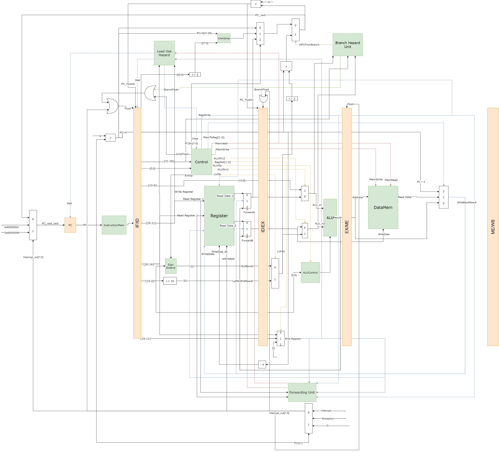

下面将围绕数据通路图介绍5级流水线CPU。

### 5级流水线：

#### IF：

  每当时钟信号clk到来的时候，PC寄存器把下一条指令的地址存入PC寄存器，指令存储器采用组合逻辑电路实现，当PC寄存器的值发生改变时下一条指令就会被取出，指令进入IF阶段。
#### ID：

  此阶段通过Control模块生成控制信号，并且把数据从寄存器中取出。其中Control模块生成控制信号的真值表如下：

|       | PCSrc[1:0] | Branch | RegWrite | RegDst[1:0] | MemRead | MemWrite | MemtoReg[1:0] | ALUSrc1 | ALUSrc2 | ExtOp | LuOp | JumpFlush |
| ----- | ---------- | ------ | -------- | ----------- | ------- | -------- | ------------- | ------- | ------- | ----- | ---- | --------- |
| add   | 0          | 0      | 1        | 1           | 0       | 0        | 0             | 0       | 0       | X     | X    | 0         |
| addu  | 0          | 0      | 1        | 1           | 0       | 0        | 0             | 0       | 0       | X     | X    | 0         |
| sub   | 0          | 0      | 1        | 1           | 0       | 0        | 0             | 0       | 0       | X     | X    | 0         |
| subu  | 0          | 0      | 1        | 1           | 0       | 0        | 0             | 0       | 0       | X     | X    | 0         |
| and   | 0          | 0      | 1        | 1           | 0       | 0        | 0             | 0       | 0       | X     | X    | 0         |
| or    | 0          | 0      | 1        | 1           | 0       | 0        | 0             | 0       | 0       | X     | X    | 0         |
| xor   | 0          | 0      | 1        | 1           | 0       | 0        | 0             | 0       | 0       | X     | X    | 0         |
| nor   | 0          | 0      | 1        | 1           | 0       | 0        | 0             | 0       | 0       | X     | X    | 0         |
| slt   | 0          | 0      | 1        | 1           | 0       | 0        | 0             | 0       | 0       | X     | X    | 0         |
| sltu  | 0          | 0      | 1        | 1           | 0       | 0        | 0             | 0       | 0       | X     | X    | 0         |
| sll   | 0          | 0      | 1        | 1           | 0       | 0        | 0             | 1       | 0       | X     | X    | 0         |
| srl   | 0          | 0      | 1        | 1           | 0       | 0        | 0             | 1       | 0       | X     | X    | 0         |
| sra   | 0          | 0      | 1        | 1           | 0       | 0        | 0             | 1       | 0       | X     | X    | 0         |
| jr    | 2          | X      | 0        | X           | 0       | 0        | X             | X       | X       | X     | X    | 1         |
| jalr  | 2          | X      | 1        | 1           | 0       | 0        | 2             | X       | X       | X     | X    | 1         |
| addi  | 0          | 0      | 1        | 0           | 0       | 0        | 0             | 0       | 1       | 1     | 0    | 0         |
| addiu | 0          | 0      | 1        | 0           | 0       | 0        | 0             | 0       | 1       | 1     | 0    | 0         |
| andi  | 0          | 0      | 1        | 0           | 0       | 0        | 0             | 0       | 1       | 0     | 0    | 0         |
| lui   | 0          | 0      | 1        | 0           | 0       | 0        | 0             | 0       | 1       | X     | 1    | 0         |
| lw    | 0          | 0      | 1        | 0           | 1       | 0        | 1             | 0       | 1       | 1     | 0    | 0         |
| sw    | 0          | 0      | 0        | X           | 0       | 1        | X             | 0       | 1       | 1     | 0    | 0         |
| slti  | 0          | 0      | 1        | 0           | 0       | 0        | 0             | 0       | 1       | 1     | 0    | 0         |
| sltiu | 0          | 0      | 1        | 0           | 0       | 0        | 0             | 0       | 1       | 1     | 0    | 0         |
| beq   | 0          | 1      | 0        | X           | 0       | 0        | X             | 0       | 0       | 1     | 0    | 0         |
| bne   | 0          | 1      | 0        | X           | 0       | 0        | X             | 0       | 0       | 1     | 0    | 0         |
| bgtz  | 0          | 1      | 0        | X           | 0       | 0        | X             | 0       | 0       | 1     | 0    | 0         |
| blez  | 0          | 1      | 0        | X           | 0       | 0        | X             | 0       | 0       | 1     | 0    | 0         |
| bltz  | 0          | 1      | 0        | X           | 0       | 0        | X             | 0       | 0       | 1     | 0    | 0         |
| j     | 1          | X      | 0        | X           | 0       | 0        | X             | X       | X       | X     | X    | 1         |
| jal   | 1          | X      | 1        | 2           | 0       | 0        | 2             | X       | X       | X     | X    | 1         |


注意，此CPU的ID阶段与课上介绍的ID阶段处理不完全相同，Forwarding 在ID阶段执行，寄存器的2个读出数据需要经过由 Forward 信号控制的多选器，原因是此流水线 CPU 的 jr 和 jalr 指令在 ID 阶段判断，所以需要提前进行 Forwarding 。

#### EX：

EX 阶段的功能为对 2 个操作数进行运算。并且在此阶段进行 Branch 指令的判断，如果分支发生，则通过清除 IF/ID 寄存器和 ID/EX 寄存器把两条指令取消掉。（参见后面的控制冒险处理）

#### ME：

ME 阶段对主存进行操作，如果是 sw 指令则把数据存入主存，如果是 lw 指令则把数据从主存中取出。注意主存的读取为组合逻辑，当读取信号到来的时候即可读出数据。写入为时序逻辑，只有当下一个时钟信号到来时才会把数据写入主存。但是由于访问主存仅在 ME 阶段进行，所以这并不会导致冒险发生。

注意此处与课上所讲的 ME 阶段不同，此时已经 MemToReg 信号已经完成了对写回数据的选择，下一个时钟到来时即可写入寄存器。

#### WB：

此阶段把数据写回寄存器。

### 各级寄存器

各级寄存器与课上所讲几乎相同，功能为储存两级之间所需传递的数据。注意图中的 ME/WB 寄存器实际上不存在，因为寄存器的写入需要上升沿的时钟信号，如果加入 ME/WB 寄存器则需要 6 个时钟周期才能完整执行一条指令。

此 CPU 的寄存器还有一个特点是 Flush 信号并不会把寄存器内容全部清空（参见后面的中断处理部分），并且还有一个 PC_next 的输入信号，在 Flush 信号到来时寄存器把下一条指令地址 PC_next 存入寄存器，而把其他信号清空。

### 冒险处理（Hazard）

流水线 CPU 在执行过程中可能会遇到的冒险有数据冒险和控制冒险，这两种冒险可以通过转发（Forwarding）、阻塞（Stall）、清除（Flush）三种方式解决。

#### 转发（Forwarding）

转发单元为 `ForwardingUnit` ，其接收的信号为EX阶段的`WriteRegister`、ME阶段的`WriteRegister`、ID阶段的`ReadRegister1`和ID阶段的`ReadRegister2`。当`EX.WriteRegister == ID.ReadRegister1`时，把EX阶段的 ALU 运算结果转发到 ID 阶段的 `RegReadData1` 。当`ME.WriteRegister == ID.ReadRegister1`时，把ME阶段的写回结果（`WriteBackResult`）转发到 ID 阶段的 `RegReadData1` 。对于`ReadRegister2`处理方法相同。

代码如下：
```verilog
module ForwardingUnit(
           input EX_ME_RegWrite, ME_WB_RegWrite,
           input [4: 0] EX_ME_WriteRegister, ME_WB_WriteRegister,
           input [4: 0] ID_EX_ReadRegister1, ID_EX_ReadRegister2,
           output [1: 0] ForwardA, ForwardB);

assign ForwardA =
       (EX_ME_RegWrite && (EX_ME_WriteRegister != 0) && EX_ME_WriteRegister == ID_EX_ReadRegister1) ? 2'b10 :
       (ME_WB_RegWrite && (ME_WB_WriteRegister != 0) && ME_WB_WriteRegister == ID_EX_ReadRegister1) ? 2'b01 : 2'b00;

assign ForwardB =
       (EX_ME_RegWrite && (EX_ME_WriteRegister != 0) && EX_ME_WriteRegister == ID_EX_ReadRegister2) ? 2'b10 :
       (ME_WB_RegWrite && (ME_WB_WriteRegister != 0) && ME_WB_WriteRegister == ID_EX_ReadRegister2) ? 2'b01 : 2'b00;

endmodule
```

```verilog
wire [31: 0] RegReadData1_ID =
     (ForwardA == 0) ? RegReadData1_init :
     (ForwardA == 1) ? WriteBackResult : ALU_out_EX;
wire [31: 0] RegReadData2_ID =
     (ForwardB == 0) ? RegReadData2_init:
     (ForwardB == 1) ? WriteBackResult : ALU_out_EX;
```

其中`RegReadData1_init`和`RegReadData2_init`直接与寄存器的输出相连。

#### Load-Use 冒险

Load-Use冒险采用Stall一个周期加转发的方式解决，转发已经在上一小节叙述完毕，此处不再赘述。下面讲解Stall的实现。

Stall的处理由`HazardUnit`模块实现，其接收4个控制信号，EX阶段的`WriteRegister`、EX阶段的`MemRead`、ID阶段的`ReadRegister1`和ID阶段的`ReadRegister2`。

当`MemRead`信号为真时，判断`EX.WriteRegister`与`ID.ReadRegister1`是否相同，如果相同则输出`Stall` 信号，该信号使`PC`寄存器和`IF/ID`寄存器保持不变，并且同时输出`Clear`信号，把`Control`的输出清空。（`ID.ReadRegister2`的处理相同）

代码如下：
```verilog
module HazardUnit(
           input ID_EX_MenRead,
           input [4: 0] ID_EX_WriteRegister, IF_ID_ReadRegister1, IF_ID_ReadRegister2,
           output Stall, ClearControl
       );

wire isStall = (ID_EX_MenRead &&
                ((ID_EX_WriteRegister == IF_ID_ReadRegister1) ||
                 (ID_EX_WriteRegister == IF_ID_ReadRegister2)
                )) ? 1 : 0;
assign Stall = isStall;
assign ClearControl = isStall;

endmodule
```

#### 控制冒险

当 j、jal 指令进入 ID 阶段时，Control 模块输出`JumpFlush`信号，把`IF/ID`寄存器清空，并且把`PCSrc`信号输出为1，使得`PC_next`等于跳转指令的地址。

当 jr、jalr 指令进入 ID 阶段时，Control 模块同样输出`JumpFlush`信号，把`IF/ID`寄存器清空，并且把`PCSrc`信号输出为2，使得`PC_next`等于第一个寄存器读出的内容。

代码如下：
```verilog
assign Flush_IF_ID =
       Clear ? 0:
       (OpCode == 6'h02 || OpCode == 6'h03) ? 1:
       (OpCode == 0 && (Funct == 6'b001000 || Funct == 6'b001001)) ? 1 :
       0;
assign PCSrc =
       Clear ? 0 :
       (OpCode == 6'h0 && (Funct == 6'h08 || Funct == 6'h09)) ? 2 :
       (OpCode == 6'h02 || OpCode == 6'h03) ? 1 : 0;
```
当 branch 指令进入 EX阶段时，输出 `BranchFlush` 信号，把`IF/ID`寄存器和`ID/EX`寄存器清空。并且输出`isPCFromBranch`信号，此信号控制的多选器把`PC_next`设置为 branch 指令的跳转地址。

执行上述操作的模块为 `BranchHazardUnit`，代码如下：
```verilog
module BranchHazardUnit(
           input [5: 0] OpCode,
           input [31: 0] ALU_in_1, ALU_in_2,
           output isPCFromBranch, BranchFlush
       );

assign isPCFromBranch =
       OpCode == 6'h04 && ALU_in_1 == ALU_in_2 ? 1 :
       OpCode == 6'h05 && ALU_in_1 != ALU_in_2 ? 1 :
       OpCode == 6'h07 && $signed(ALU_in_1) > 0 ? 1 :
       OpCode == 6'h06 && $signed(ALU_in_1) <= 0 ? 1 :
       OpCode == 6'h01 && $signed(ALU_in_1) < 0 ? 1 : 0;
assign BranchFlush = isPCFromBranch;

endmodule
```

### 中断和异常处理

中断信号的处理与控制冒险的处理类似，都是把指令清空并且插入新的指令。但是中断信号的处理相对复杂一些。因为branch指令在`EX`阶段判断，所以发生中断时无法确定下一条指令是哪一条指令，最直接的方式是把`IF`、`ID`、`EX`三个阶段的指令全部清空，这样 branch 指令就无法执行，同时把`EX`阶段的指令地址存入`$26`寄存器，这样在中断完成的时候就可以把这条指令再取出来并执行。为了执行这个任务需要把`$26`寄存器的输入单独拉出来，禁止其被程序写入，同时在寄存器堆上加一个`isWrite26`信号，控制是否对`$26`寄存器进行写入。

代码如下：
```verilog
always @(posedge reset or posedge clk)
    if (reset)
    begin : Loop
        integer i;
        for (i = 1; i < 32; i = i + 1)
            if (i == 29)
                RF_data[i] = InitialSp;
            else
                RF_data[i] <= 32'h00000000;
    end
    else
    begin
        if (RegWrite && Write_register != 5'b00000 &&
                Write_register != 5'd26)
            RF_data[Write_register] <= Write_data;
        if (isWrite_26)
            RF_data[26] <= WriteData_26;
    end
```

`EX`阶段的指令地址可以通过`ID/EX.PC+4`信号获取，存入`$26`寄存器之前只需减4即可。但是这样做又会出现新的问题，那就是如果`EX`阶段的指令是空指令怎么办？

为了解决这个问题，需要改变`Flush`信号的执行方式，当`Flush`信号被执行时，各级寄存器中的`PC+4`寄存器并不会被清零，而是把`PC_next`存进去。这样即使指令被清空，`PC+4`寄存器仍能用来表示下一条指令的地址。

代码如下：
```verilog
PC_plus_4[2] <= reset ? 4 : (BranchFlush || Interrupt_out[1]) ? PC_next + 4 : PC_plus_4_ID;
```

这段代码仅展示了`ID/EX.PC+4`如何进行写入，其他`PC+4`寄存器同理。

### 外设

#### 中断定时器
| 地址       | 功能            | 备注                                                                                                                                                            |
| ---------- | --------------- | --------------------------------------------------------------------------------------------------------------------------------------------------------------- |
| 0x40000000 | 定时器 TH       | 每当 TL 计数到全 1 时，自动加载 TH 值到 TL                                                                                                                      |
| 0x40000004 | 定时器 TL       | 定时器计数器， TL 值随时钟递增                                                                                                                                  |
| 0x40000008 | 定时器控制 TCON | 0bit：定时器使能控制， 1-enable， 0-disable<br />1bit：定时器中断控制， 1-enable， 0-disable<br />2bit：定时器中断状态，中断控制启用时，计数到全 1 会将本位置 1 |

#### LED

| 地址       | 功能     | 备注                           |
| ---------- | -------- | ------------------------------ |
| 0x4000000C | 外部 LED | [7: 0]对应开发板上 8 个 LED 灯 |

#### 七段数码管

| 地址       | 功能       | 备注                                            |
| ---------- | ---------- | ----------------------------------------------- |
| 0x40000010 | 七段数码管 | [7: 0] 是数码管控制<br/>[11: 8] 是 4 个阳极控制 |

#### 系统时钟计数器

| 地址       | 功能           | 备注                                                                   |
| ---------- | -------------- | ---------------------------------------------------------------------- |
| 0x40000014 | 系统时钟计数器 | 系统复位时， systick 复位为零，之后每系统时钟周期，计数值加1。忽略溢出 |

## 仿真验证：

### 排序代码验证：

本实验所采用的排序算法为冒泡排序，数据为 128 个 32 位无符号数。

MIPS代码如下：

```mips
swap:	# $a0 = int *v; $a1 = k
	
	sll $t0 $a1 2		# $t0 = k * 4
	addu $t0 $t0 $a0		# $t0 = v + k
	
	lw $t1 ($t0)		# temp = v[k]
	
	addi $t0 $t0 4		# $t0 = v + k + 1
	
	lw $t2 ($t0)		# $t2 = v[k + 1]
	subi $t0 $t0 4		# $t0 = v + k
	sw $t2 ($t0)		# v[k] = $t2
	
	addi $t0 $t0 4		# $t0 = v + k + 1
	sw $t1 ($t0)
	
	j call_swap_end
	
bubsort:	# $a0 = int *v; $a1 = n
	subi $sp $sp 20		#save stack
	sw $ra 0($sp)		#
	sw $a0 4($sp)		#
	sw $a1 8($sp)
	sw $s0 12($sp)
	sw $s1 16($sp)
	
	li $s0 0		# $s0 store i
	li $s1 0		# $s1 store j
	
	li $s0 0		# i = 0
	
	bubsort_for:
		bge $s0 $a1 exit_bubsort_for	# if i >= n exit for
		
		subi $s1 $s0 1			# j = i - 1
		bubsort_for_2:

			blt $s1 $zero exit_bubsort_for_2	# if !(j >= 0) , break
			
			sll $t1 $s1 2		# $t1 = j * 4
			addu $t1 $t1 $a0		# $t1 = v + j
			lw $t2 ($t1)		# $t2 = v[j]
			
			addi $t3 $t1 4		# $t3 = v + j + 1
			lw $t3 ($t3)		# $t3 = v[j + 1]

			ble $t2 $t3 exit_bubsort_for_2	# if !(v[j] > v[j + 1]) , break
			
			move $s2 $a1
			move $a1 $s1
				j swap
			call_swap_end:
			move $a1 $s2
			
			subi $s1 $s1 1		# j--
			j bubsort_for_2
		exit_bubsort_for_2:
		
		addi $s0 $s0 1	#i++
		j bubsort_for
	exit_bubsort_for:
	
	li $v0 0
	lw $ra 0($sp)		#load stack
	lw $a0 4($sp)		#
	lw $a1 8($sp)
	lw $s0 12($sp)
	lw $s1 16($sp)
	addi $sp $sp 20		#
	j call_bubsort_end
	

	
main:	
	j import_number
	import_number_end:
	li $t0 0			# reset $t0
	
	#lw $t6 0x40000014	# load SysTick init
	
	la $ra call_bubsort_end
	move $a0 $sp		# $a0 = address
	li $a1 128		# $a1 = N
		j bubsort
	call_bubsort_end:
	
	lw $t7 0x40000014	# load SysTick last
	sub $t6 $t7 $t6		# t6 = Tick Count
	
	
	li $7 0xffffff00		# enable Timer
	sw $7 0x40000000
	li $7 3
	sw $7 0x40000008
	
	la $ra main_end
	main_end:		#
	jr $ra			# enable Interrupt
```

其中还有大段代码负责数据导入，这里把这部分代码略去了。

MIPS 仿真器的排序结果：
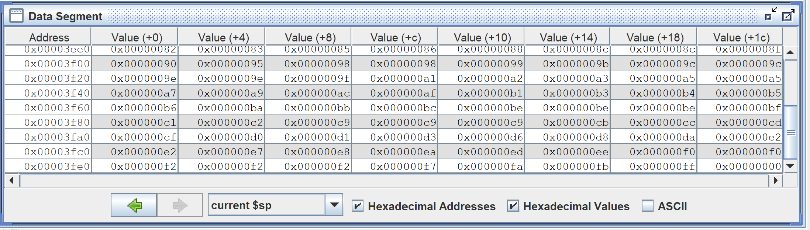

Vivado仿真结果：
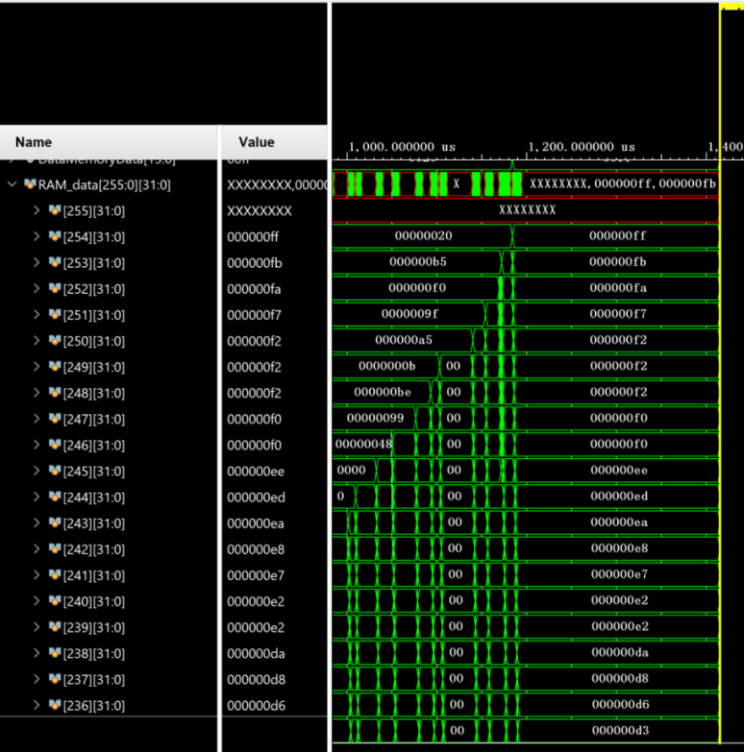

可以看到排序结果完全正确。

Mars中执行指令数：
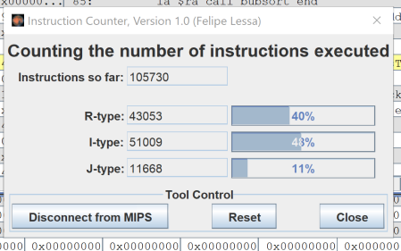

Vivado中仿真得出的周期数：
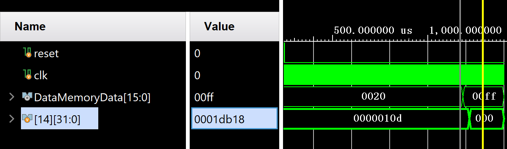

该16进制数为121624。可以看到指令数和周期数有较大差距，这是因为j型指令和branch指令会把前面的指令清空，导致周期数比指令数要多。

### 中断验证

中断测试代码如下：
```mips
j main
j Interrupt

main:
li $2 200
add $3 $2 $2
xor $4 $3 $2
sll $5 $4 8
sub $6 $5 $4

li $7 0xfffffff0
sw $7 0x40000000
li $7 3
sw $7 0x40000008

la $ra End
End:
jr $ra

Interrupt:

lw $27 0x40000008		# Disable Timer Interrupt
andi $27 $27 0x9			#
sw $27 0x40000008		# Clear TCON [2 : 1]

addi $27 $27 0x00000002		# Enable Timer Interrupt
sw $27 0x40000008		# TCON[1] <= 1

jr $26
```
Vivado仿真结果如图：
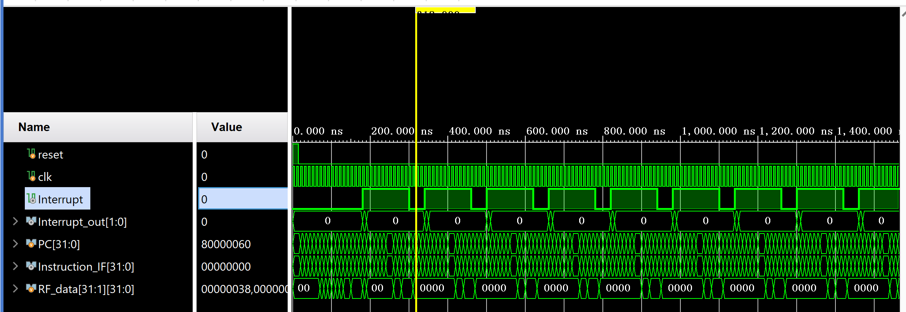

可以看到当主程序代码执行完毕后定时中断被触发，能够正确执行定时中断。

### 数码管显示验证

根据实验要求，需要把程序执行完毕后的 SysTick 显示在数码管上。由于代码行数过多，此处不放出全部代码，只把与显示相关的代码放出。

```mips
li $s0 0x3d40 		# base

lw $a0 ($s0)		# a0 = record
sll $a0 $a0 8		# a0 << 8

bne $a0 0  Exit_if	# if a0 == 0 a0 = 0xff
li $a0 0xff

Exit_if:			# else
sw $a0 ($s0)

addiu $1 $0 0xff
beq $a0 $1 case0
addiu $1 $0 0xff
sll $1 $1 8
beq $a0 $1 case1
lui $1 0xff
beq $a0 $1 case2
lui $1 0xff00
beq $a0 $1 case3

case0:
andi $a1 $t6 0xf
li $a2 0x100
j Exit_case
case1:
andi $a1 $t6 0xf0
srl $a1 $a1 4
li $a2 0x200
j Exit_case
case2:
andi $a1 $t6 0xf00
srl $a1 $a1 8
li $a2 0x400
j Exit_case
case3:
andi $a1 $t6 0xf000
srl $a1 $a1 12
li $a2 0x800
j Exit_case

Exit_case:

beq $a1 0x0 Display0
beq $a1 0x1 Display1
beq $a1 0x2 Display2
beq $a1 0x3 Display3
beq $a1 0x4 Display4
beq $a1 0x5 Display5
beq $a1 0x6 Display6
beq $a1 0x7 Display7
beq $a1 0x8 Display8
beq $a1 0x9 Display9
beq $a1 0xa Display10
beq $a1 0xb Display11
beq $a1 0xc Display12
beq $a1 0xd Display13
beq $a1 0xe Display14
beq $a1 0xf Display15

Display0:
li $1 63
or $a2 $a2 $1
sw $a2 0x40000010
j Exit_Display

Display1:
li $1 6
or $a2 $a2 $1
sw $a2 0x40000010
j Exit_Display

Display2:
li $1 91
or $a2 $a2 $1
sw $a2 0x40000010
j Exit_Display

Display3:
li $1 79
or $a2 $a2 $1
sw $a2 0x40000010
j Exit_Display

Display4:
li $1 102
or $a2 $a2 $1
sw $a2 0x40000010
j Exit_Display

Display5:
li $1 109
or $a2 $a2 $1
sw $a2 0x40000010
j Exit_Display

Display6:
li $1 125
or $a2 $a2 $1
sw $a2 0x40000010
j Exit_Display

Display7:
li $1 7
or $a2 $a2 $1
sw $a2 0x40000010
j Exit_Display

Display8:
li $1 127
or $a2 $a2 $1
sw $a2 0x40000010
j Exit_Display

Display9:
li $1 111
or $a2 $a2 $1
sw $a2 0x40000010
j Exit_Display

Display10:
li $1 119
or $a2 $a2 $1
sw $a2 0x40000010
j Exit_Display

Display11:
li $1 124
or $a2 $a2 $1
sw $a2 0x40000010
j Exit_Display

Display12:
li $1 57
or $a2 $a2 $1
sw $a2 0x40000010
j Exit_Display

Display13:
li $1 94
or $a2 $a2 $1
sw $a2 0x40000010
j Exit_Display

Display14:
li $1 121
or $a2 $a2 $1
sw $a2 0x40000010
j Exit_Display

Display15:
li $1 113
or $a2 $a2 $1
sw $a2 0x40000010
j Exit_Display

Exit_Display:
```
仿真结果验证如图：
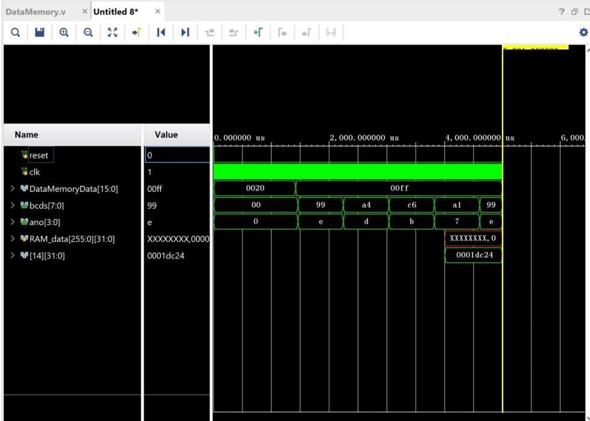

可以看到程序执行的周期数SysTick 为 1dc24 。bcd数码管轮询显示为99、a4、c6、a1。经验证在数码管上依次显示为 4、2、c、d。仿真结果正确。

### FPGA验证

把程序生成比特流后烧写到FPGA里，然后按下复位键，松开后在数码管上显示出 "dc24" 的字样，如下图所示

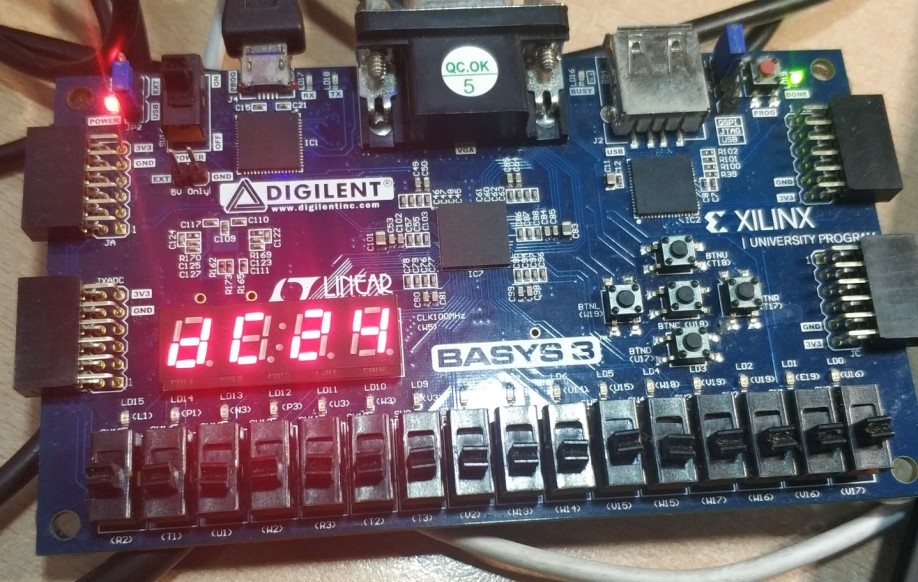

可知程序执行结果正确。

## 综合情况

### 面积性能

综合后面积性能如下图：


可以看到占用 LUT 一共占用了4412 个（全部用于逻辑），寄存器一共占用了 9748 个。

### 时序性能

综合后时序报告如图：


可以看到WNS为1.540ns。理论最高频率为 107.42 MHz。

### 最长时间路径

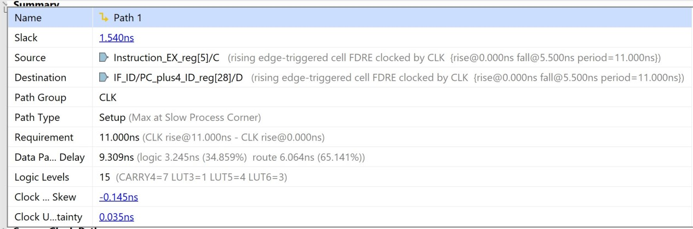
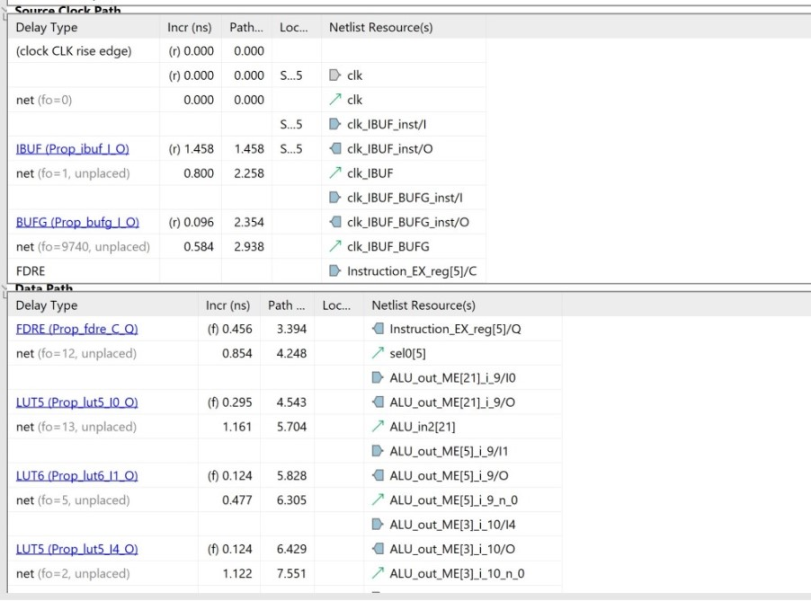
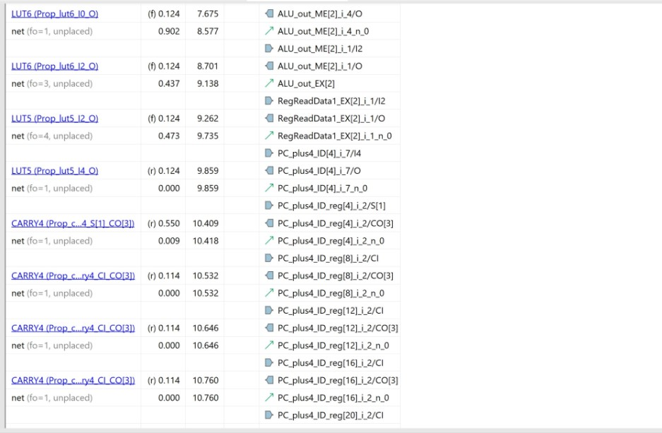
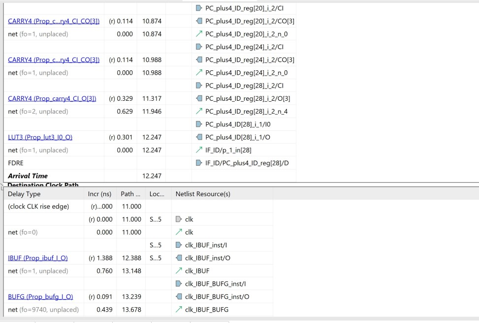
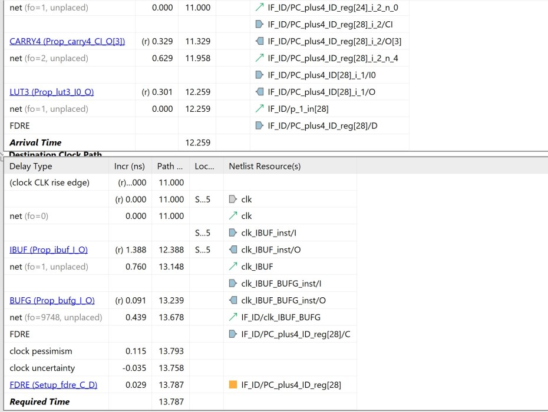

可以看到最长时间路径从 EX 阶段的指令出发，经过ALU运算后得到 ALU_out ，然后从寄存器中读取数据，并最终改变 PC+4 .所以这条路径应该对应着带转发的 jr 或 jalr 指令。


## 调试心得与体会

1. 在调试过程中要多关注 PC 寄存器的变化，根据 PC 寄存器的变化可以很快地推断出程序哪个地方出现了问题
2. 编写verilog 代码时要正确命名各种变量，良好的命名方式可以节省大量调试时间和调试精力
3. 选用一个方便的画图软件，并在画数据通路图阶段多费功夫，尽量画出一个完整、清晰的数据通路图。可以帮助更快地组织代码，完成调试。
4. 在测试时充分利用已有的软件资源，比如Mars可以把MIPS代码生成为二进制或16进制文件，然后可以直接导入到指令存储器中进行仿真。


## 文件清单


```
+---CPU.srcs\sources_1\imports\single_cycle_hw_test1.srcs
|	+---ALU.v
|	+---ALU.Control.v
|	+---BranchHazard.v
|	+---Control.v
|	+---CPU.v
|	+---DataMemory.v
|	+---ForwardingUnit.v
|	+---HazardUnit.v
|	+---ID_EXE_REG.v
|	+---IF_ID_reg.v
|	+---InstrucionMemory2.v
|	+---RegisterFile.v
+---CPU.srcs\sim_1\imports\single_cycle_hw_test1.srcs
|	+---test_cpu.v
+---CPU.srcs\constrs_1\new
|	+---CPU.xdc
+---CPU.xpr
+---BubbleSort.asm
+---images\
+---pipeline.drawio
```

其中asm文件为测试使用的MIPS代码，srcs里为源文件，contrans里为约束文件，test_cpu.，images/为存放图片的文件夹，pipeline.drawio为数据通路设计图文件，可以通过网址 www.draw.io 打开。

注意：本代码采用了SystemVerilog语法，在导入文件后应该设置文件的语言为SystemVerilog。

